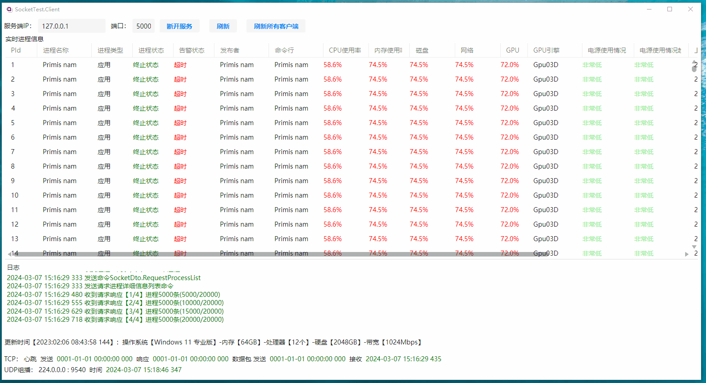

# C#百万对象序列化与网络传输实践

| 日期       | 更新内容                                                     | 版本  | 作者         |
| ---------- | ------------------------------------------------------------ | ----- | ------------ |
| 2023-12-16 | 初建，添加网络对象定义                                       | 0.0.1 | 沙漠尽头的狼 |
| 2023-12-24 | 修改数据类型，节约网络传输大小和减少数据包个数               | 0.0.2 | 沙漠尽头的狼 |
| 2024-02-07 | 1）添加界面截图，2）添加AvaloniaUI分支，1个UDP包拆分2个      | 0.0.3 | 沙漠尽头的狼 |
| 2024-02-08 | 完善进程状态                                                 | 0.0.4 | 沙漠尽头的狼 |
| 2024-02-09 | 修改通信对象，优化发包效率：常更新字段直接读取byte[]，优化数据包组装效率 | 0.0.5 | 沙漠尽头的狼 |

[TOC]

## 1. 背景

完善文章《[C#百万对象序列化深度剖析：如何在网络传输中实现速度与体积的完美平衡 (dotnet9.com)](https://dotnet9.com/2023/12/deep-analysis-of-csharp-million-object-serialization-how-to-achieve-a-perfect-balance-between-speed-and-volume-in-network-transm)》，以客户端实时获取服务端进程信息为测试案例：

1. 以操作系统进程信息作为传输数据扩展数个网络数据包，操作系统进程有：进程ID、进程名称、CPU利用率、内存使用率等。
2. C/S两端使用Avalonia UI作为界面展示；
3. 添加TCP通信，客户端通过命令方式向服务端请求数据，服务端可被动响应，也可主动推送，主动推送场景包括修改进程、进程结构变化（增加进程、删除进程）等；
4. 添加UDP通信，服务端可组播数据，主要是常变数据，比如CPU利用率、内存使用率、电源使用情况等；
5. Avalonia UI百万数据DataGrid加载、实时更新。

## 2. 数据包【0.0.5】

**数据包=头部+数据**

### 2.1. 头部【0.0.5】

| 字段名          | 数据类型 | 说明                               |
| --------------- | -------- | ---------------------------------- |
| PacketSize      | int      | 数据包总大小=头部大小+数据部分大小 |
| SystemId        | long     | 系统Id                             |
| `ObjectId`      | byte     | 对象Id                             |
| `ObjectVersion` | byte     | 对象版本                           |

### 2.2. 数据部分【0.0.5】

1. 统一编码为UTF-8。

1. TCP数据包基本使用`MessagePack`对对象进行二进制压缩，理论上数据包会比常规二进制序列化小2/3左右。
2. UDP包不使用任何压缩框架，对于大数字类型(int\double)压缩反而让数据包体积更大，所以使用`BinnaryReader`、`BinnaryWriter`做序列化和反序列化。
3. `string`|`List<T>`|`Dictionary<T1,T2>`等集合类型：前4字节用int表示数量，后面部分为实际数据byte[]。

## 3. 网络对象定义【0.0.5】

TCP、UDP传输数据包定义。

### 3.1. TCP数据包【0.0.5】

| 对象Id | 对象版本 | 对象名                | 说明                                     |
| ------ | -------- | --------------------- | ---------------------------------------- |
| 1      | 1        | RequestBaseInfo       | 请求服务基本信息                         |
| 2      | 1        | ResponseBaseInfo      | 响应请求服务基本信息                     |
| 3      | 1        | RequestProcessIDList  | 请求进程ID列表                           |
| 4      | 1        | ResponseProcessIDList | 响应请求进程ID列表，更新实时数据需要使用 |
| 5      | 1        | RequestProcessList    | 请求进程详细信息列表                     |
| 6      | 1        | ResponseProcessList   | 响应请求进程详细信息列表                 |
| 7      | 1        | UpdateProcessList     | 更新进程详细信息列表                     |
| 8      | 1        | ChangeProcessList     | 进程结构变化：增加、减少进程             |
| 199    | 1        | Heartbeat             | TCP心跳包                                |

#### RequestBaseInfo【0.0.1】

| 字段名 | 数据类型 | 说明   |
| ------ | -------- | ------ |
| TaskId | int      | 任务Id |

#### ResponseBaseInfo【0.0.2】

| 字段名             | 数据类型 | 说明                                                         |
| ------------------ | -------- | ------------------------------------------------------------ |
| TaskId             | int      | 任务Id                                                       |
| OS                 | string?  | 操作系统名称                                                 |
| MemorySize         | byte     | 系统内存大小（单位GB）                                       |
| ProcessorCount     | byte     | 处理器个数                                                   |
| DiskSize           | short    | 硬盘总容量（单位GB）                                         |
| NetworkBandwidth   | short    | 网络带宽（单位Mbps）                                         |
| Ips                | string?  | 服务器IP地址，多个IP地址以，分隔                             |
| TimestampStartYear | byte     | 通信对象时间戳起始年份，比如：2023，表示2023年1月1号开始计算时间戳，后面的时间戳都以这个字段计算为准，精确到0.1s，即100ms，主要用于节约网络对象传输大小 |
| LastUpdateTime     | uint     | 最后更新时间                                                 |

#### RequestProcessIDList【0.0.5】

| 字段名 | 数据类型 | 说明   |
| ------ | -------- | ------ |
| TaskId | int      | 任务Id |

#### ResponseProcessIDList【0.0.5】

| 字段名 | 数据类型 | 说明                                                         |
| ------ | -------- | ------------------------------------------------------------ |
| TaskId | int      | 任务Id                                                       |
| IDList | int[]    | 进程ID数组，有顺序，更新进程实时数据包需要根据该数组查找进程、更新数据 |

#### RequestProcessList【0.0.1】

| 字段名 | 数据类型 | 说明   |
| ------ | -------- | ------ |
| TaskId | int      | 任务Id |

#### ResponseProcessList【0.0.5】

| 字段名    | 数据类型             | 说明       |
| --------- | -------------------- | ---------- |
| TaskId    | int                  | 任务Id     |
| TotalSize | int                  | 总数据大小 |
| PageSize  | int                  | 分页大小   |
| PageCount | int                  | 总页数     |
| PageIndex | int                  | 页索引     |
| Processes | `List<ProcessItem>?` | 进程列表   |

#### ProcessItem【0.0.5】

| 字段名          | 数据类型 | 说明                                                         |
| --------------- | -------- | ------------------------------------------------------------ |
| Pid             | int      | 进程ID                                                       |
| Name            | string?  | 进程名称                                                     |
| Type            | byte     | 进程类型，0：应用，1：后台进程                               |
| ProcessStatus   | byte     | 进程状态，0：新建状态，1：就绪状态，2：运行状态，3：阻塞状态，4：终止状态 |
| AlarmStatus     | byte     | 告警状态，没有特别意义，可组合位域状态，0：正常，1：超时，2：超限，切换用户 |
| Publisher       | string?  | 发布者                                                       |
| CommandLine     | string?  | 命令行                                                       |
| Cpu             | short    | Cpu（所有内核的总处理利用率），最后一位表示小数位，比如253表示25.3% |
| Memory          | short    | 内存（进程占用的物理内存），最后一位表示小数位，比如253表示25.3%，值可根据基本信息计算 |
| Disk            | short    | 磁盘（所有物理驱动器的总利用率），最后一位表示小数位，比如253表示25.3%，值可根据基本信息计算 |
| Network         | short    | 网络（当前主要网络上的网络利用率），最后一位表示小数位，比如253表示25.3%，值可根据基本信息计算 |
| Gpu             | short    | Gpu(所有Gpu引擎的最高利用率)，最后一位表示小数位，比如253表示25.3 |
| GpuEngine       | byte     | Gpu引擎，0：无，1：GPU 0 - 3D                                |
| PowerUsage      | byte     | 电源使用情况（CPU、磁盘和GPU对功耗的影响），0：非常低，1：低，2：中，3：高，4：非常高 |
| PowerUsageTrend | byte     | 电源使用情况趋势（一段时间内CPU、磁盘和GPU对功耗的影响），0：非常低，1：低，2：中，3：高，4：非常高 |
| LastUpdateTime  | uint     | 上次更新时间                                                 |
| UpdateTime      | uint     | 更新时间                                                     |

#### UpdateProcessList【0.0.1】

| 字段名    | 数据类型             | 说明     |
| --------- | -------------------- | -------- |
| Processes | `List<ProcessItem>?` | 进程列表 |

#### ChangeProcessList【0.0.1】

| 字段名 | 数据类型 | 说明 |
| ------ | -------- | ---- |
|        |          |      |

#### Heartbeat【0.0.1】

| 字段名 | 数据类型 | 说明 |
| ------ | -------- | ---- |
|        |          |      |

### 3.2. UDP数据包【0.0.5】

| 对象Id | 对象版本 | 对象名                    | 说明                 |
| ------ | -------- | ------------------------- | -------------------- |
| 200    | 1        | UpdateRealtimeProcessList | 更新进程实时数据列表 |
| 201    | 1        | UpdateGeneralProcessList  | 更新进程一般数据列表 |

#### UpdateRealtimeProcessList【0.0.5】

| 字段名    | 数据类型 | 说明                                                         |
| --------- | -------- | ------------------------------------------------------------ |
| TotalSize | int      | 总数据大小                                                   |
| PageSize  | int      | 分页大小                                                     |
| PageCount | int      | 总页数                                                       |
| PageIndex | int      | 页索引，客户端根据收到的进程ID列表、详细信息列表为基础，取当前数据包开始进程索引到结束进程索引进行数据更新 |
| Cpus      | byte[]   | 一个进程占2字节(short)                                       |
| Memories  | byte[]   | 一个进程占2字节(short)                                       |
| Disks     | byte[]   | 一个进程占2字节(short)                                       |
| Networks  | byte[]   | 一个进程占2字节(short)                                       |

#### UpdateGeneralProcessList【0.0.5】

| 字段名          | 数据类型 | 说明                                                         |
| --------------- | -------- | ------------------------------------------------------------ |
| TotalSize       | int      | 总数据大小                                                   |
| PageSize        | int      | 分页大小                                                     |
| PageCount       | int      | 总页数                                                       |
| PageIndex       | int      | 页索引，客户端根据收到的进程ID列表、详细信息列表为基础，取当前数据包开始进程索引到结束进程索引进行数据更新 |
| ProcessStatuses | byte[]   | 进程状态，一个进程占1字节(byte)                              |
| AlarmStatuses   | byte[]   | 告警状态，一个进程占1字节(byte)                              |
| Gpus            | byte[]   | 一个进程占2字节(short)                                       |
| GpuEngines      | byte[]   | 一个进程占1字节(byte)                                        |
| PowerUsages     | byte[]   | 一个进程占1字节(byte)                                        |
| PowerUsageTrend | byte[]   | 一个进程占1字节(byte)                                        |
| UpdateTimes     | byte[]   | 一个进程占4字节(byte)                                        |

### 3.3. 部分枚举定义

```csharp
/// <summary>
///     进程类型
/// </summary>
public enum ProcessType
{
    [Description("应用")] Application,
    [Description("后台进程")] BackgroundProcess
}

/// <summary>
///     进程运行状态
/// </summary>
public enum ProcessStatus
{
    [Description("新建状态")] New,
    [Description("就绪状态")] Ready,
    [Description("运行状态")] Running,
    [Description("阻塞状态")] Blocked,
    [Description("终止状态")] Terminated
}

/// <summary>
///     GPU引擎
/// </summary>
public enum GpuEngine
{
    [Description("无")] None,
    [Description("GPU 0 - 3D")] Gpu03D
}

/// <summary>
///     电源使用情况
/// </summary>
public enum ProcessPowerUsage
{
    [Description("非常低")] VeryLow,
    [Description("低")] Low,
    [Description("中")] Moderate,
    [Description("高")] High,
    [Description("非常高")] VeryHigh
}

/// <summary>
///     进程告警状态（没有意义，只用于测试枚举位域使用）
/// </summary>
[Flags]
public enum ProcessAlarmStatus
{
    [Description("正常")] Normal = 0,
    [Description("超时")] Overtime = 1,
    [Description("超限")] OverLimit = 2,
    [Description("切换用户")] UserChanged = 4
}
```

## 4. 效果

服务端使用Avalonia UI开发：


客户端使用Avalonia UI开发：



## 5. 技术交流

### 5.1. 技术网站：

- Https://dotnet9.com
- Https://codewf.com
- https://dotnetchat.com

### 5.2. 微信公众号

| Dotnet9                                                    | 快乐玩转技术                                                 |
| ---------------------------------------------------------- | ------------------------------------------------------------ |
|  |  |

### 5.3. 赞助

| 微信支付                                         | 支付宝                                        | QQ支付                                       |
| ------------------------------------------------ | --------------------------------------------- | -------------------------------------------- |
|  |  |  |

